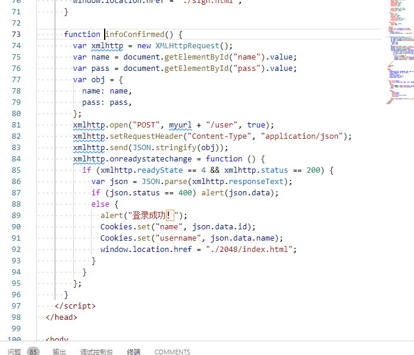
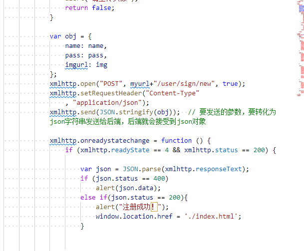
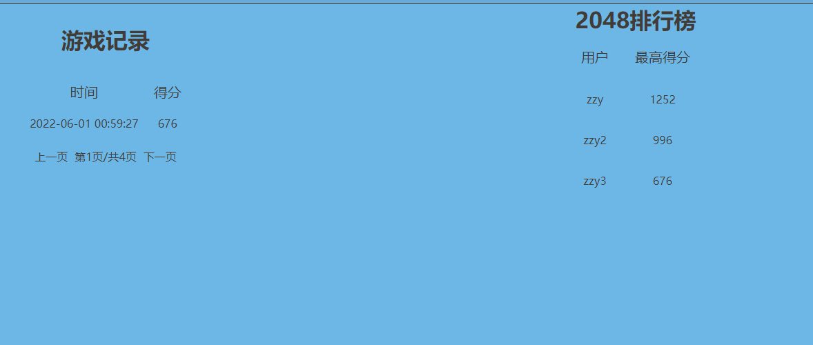

<center><h1>2021-2022学年第2学期</h1></center>


<div style="margin-left:38%">- 课程名称:跨平台脚本开发技术</div>
<div style="margin-left:38%">- 实验项目:2048期末大作业</div>
<div style="margin-left:38%">- 专业班级<u>计算1902</u></div>
<div style="margin-left:38%">- 学生学号<u>31901063</u></div>
<div style="margin-left:38%">- 学生姓名<u>郑泽阳</u></div>
<div style="margin-left:38%">- 实验指导教师:郭鸣</div>

[TOC]

# 一、与自我评估

## （一）项目

|  姓名  |   学号   |   班级   |                       任务                        | 权重 |
| :----: | :------: | :------: | :-----------------------------------------------: | ---- |
| 郑泽阳 | 31901063 | 计算1902 |    页面设计 本地服务器搭建  排行榜  Cookie设计 登录 游戏记录 游戏改造 | 1 |

## （二）项目自我评估表

| 技术点         | 自评等级:(1-5) | 备注                                                         |
| :------------- | :------------: | ------------------------------------------------------------ |
| Cookie |       4        | Cookie进行用户身份，进行[Session](https://baike.baidu.com/item/Session/479100)跟踪而储存在用户本地终端上的数据（经过加密），由用户[客户端](https://baike.baidu.com/item/客户端/101081)计算机暂时或永久保存的信息 |
| Mysql          |       4        | 连接服务器端数据库                                           |
| 函数式编程     |       4        | 函数作为参数,纯函数                                          |
| express框架    |       4        | 采用express框架                                                 |
| RestAPI        |       4        | Restful风格API                                           |
| upload.js      |       3        | 封装头像到url地址                                            |

## （三）github提交记录（仓库地址https://github.com/pzypzy777/JS_finalwork）


# 二、项目自评等级:(1-5)

​		**等级：**4


# 三、项目说明

## （一）使用的技术

|  前端  |  后端   |
| :----: | :-----: |
|  html  | nodejs  |
|   js   | express |
| jquery |   js    |
|  css   |  mysql  |


## （二）项目基于现有的2048代码

### 1.参考说明

​参考代码来自：https://github.com/226YZY/my2048game


#### **改进 2048游戏界面：**


**增加关卡选择功能。**


**增加登录注册、游戏记录、排行榜**


### 2.用户登录&&注册

#### 代码	






### 3.界面


### 4.排行榜

#### 实现说明

从游戏记录找所有用户的最高记录

```js
queryRank: function (id,callback) { //排行榜
    let sqlparam = []
    pool.query(
      "SELECT name,max FROM user ORDER BY max DESC limit 5",sqlparam,
      function (error, result) {
        if (error) throw error;
        callback(result);
      }
    );
  },
```



### **5.服务器**

​		使用express+nodejs+mysql，通过express框架创建服务器，使用mysql数据库，查看通过Navicat查看。

#### **数据库表结构**

```mysql
/*
Navicat MySQL Data Transfer

Source Server         : zz
Source Server Version : 80028
Source Host           : localhost:3306
Source Database       : js

Target Server Type    : MYSQL
Target Server Version : 80028
File Encoding         : 65001

Date: 2022-06-01 14:33:13
*/

SET FOREIGN_KEY_CHECKS=0;

-- ----------------------------
-- Table structure for record
-- ----------------------------
DROP TABLE IF EXISTS `record`;
CREATE TABLE `record` (
  `id` int NOT NULL AUTO_INCREMENT,
  `username` varchar(255) CHARACTER SET utf8mb4 COLLATE utf8mb4_0900_ai_ci DEFAULT NULL,
  `score` bigint DEFAULT NULL,
  `time` timestamp NULL DEFAULT NULL,
  PRIMARY KEY (`id`) USING BTREE
) ENGINE=InnoDB AUTO_INCREMENT=33 DEFAULT CHARSET=utf8mb4 COLLATE=utf8mb4_0900_ai_ci ROW_FORMAT=DYNAMIC;

-- ----------------------------
-- Table structure for user
-- ----------------------------
DROP TABLE IF EXISTS `user`;
CREATE TABLE `user` (
  `id` bigint NOT NULL AUTO_INCREMENT,
  `name` varchar(255) CHARACTER SET utf8mb4 COLLATE utf8mb4_0900_ai_ci DEFAULT NULL,
  `password` varchar(255) CHARACTER SET utf8mb4 COLLATE utf8mb4_0900_ai_ci DEFAULT NULL,
  `max` bigint DEFAULT NULL,
  `head` varchar(255) CHARACTER SET utf8mb4 COLLATE utf8mb4_0900_ai_ci DEFAULT NULL,
  PRIMARY KEY (`id`) USING BTREE
) ENGINE=InnoDB AUTO_INCREMENT=9 DEFAULT CHARSET=utf8mb4 COLLATE=utf8mb4_0900_ai_ci ROW_FORMAT=DYNAMIC;


```
##### **运行流程**
进入myexpressw文件夹,执行代码
`npm install`

`npm run start`

`node server.js`


**主要代码**

**a、app.js**

```js
var createError = require('http-errors');
var express = require('express');
var path = require('path');
var cookieParser = require('cookie-parser');
var logger = require('morgan');
var bodyParse = require('body-parser')
require('./public/dblink/database')
var usersRouter = require('./routes/user');
var recordRouter = require('./routes/record');

var app = express();

//跨域
app.all('*', function (req, res, next){
  res.header("Access-Control-Allow-Origin", "*");
  res.header("Access-Control-Allow-Headers", "X-Requested-With");
  res.header("Access-Control-Allow-Methods","PUT,POST,GET,DELETE,OPTIONS");
  res.header('Access-Control-Allow-Headers', 'Content-Type, Content-Length, Authorization, Accept, X-Requested-With , yourHeaderFeild');
  res.header("X-Powered-By",' 3.2.1')
  res.header("Content-Type", "application/json;charset=utf-8");
  next();
});

// view engine setup
app.set('views', path.join(__dirname, 'views'));
app.set('view engine', 'jade');

app.use(logger('dev'));
app.use(express.json());
app.use(express.urlencoded({
  extended: false
}));
app.use(cookieParser());
app.use(express.static(path.join(__dirname, 'public')));

app.use('/user', usersRouter);
app.use('/record', recordRouter);

app.use(function (req, res, next) {
  next(createError(404));
});

// error handler
app.use(function (err, req, res, next) {
  // set locals, only providing error in development
  res.locals.message = err.message;
  res.locals.error = req.app.get('env') === 'development' ? err : {};

  // render the error page
  res.status(err.status || 500);
  res.render('error');
});

module.exports = app;
```

**b、database.js**

服务器mysql数据库

```js
var mysql = require('mysql');
var pool = mysql.createConnection({
    host: '127.0.0.1',
    port: '3306',
    user: 'root',
    password: '123456',
    database: 'js'
});

module.exports = {
    pool
}
```

**c、routes**文

```js
var express = require('express');
var router = express.Router();
let {
  add,
  query,
  findByName,
  queryOne,
  update,
  findUsernameByID
} = require("../public/dbop/user"); // 数据库操作


router.post('/:id', function (req, res) {
  let urlParam = req.body;
  findByName(urlParam, function (success) {
    if (success != null && success.id != urlParam.id) {
      res.json({
        status: "400",
        data: '账号已经被用过了哦'
      });
    } else {
      update(urlParam, function (success) {
        if (success == null) {
          res.json({
            status: "400",
            data: '操作失败'
          });
        } else {
          res.json({
            status: "200",
            data: ""
          });
        }
      })
    }

  })

});


router.get('/find/:id', function (req, res) {
  let urlParam = req.params.id;
  findUsernameByID(urlParam, function (success) {
      res.json({
        status: "200",
        data: success
      });
  })

});


router.post('', function (req, res, next) {
  let urlParam = req.body;
  query(urlParam, function (success) {
    if (success == null) {
      res.json({
        status: "400",
        data: '账号或者密码错误'
      });
    } else {
      res.json({
        status: "200",
        data: success
      });
    }

  })
});
```

**i、dbop文件夹**

对数据库进行操作的地方

```js
let { pool } = require("../dblink/database.js");
module.exports = {
  add: function (user, callback) {
    // users表中增加user操作
    let sqlparam = [user.name ? user.name : "", user.pass ? user.pass : ""];

    pool.query(
      "INSERT INTO user(name,password) VALUES (?,?);",
      sqlparam,
      function (error, result) {
        if (error) throw error;
        callback(result);
      }
    );
  },
  queryOne: function (params, callback) {
    let sqlparam = [params];
    pool.query(
      "SELECT * FROM user WHERE id = ?;",
      sqlparam,
      function (error, result) {
        if (error) throw error;
        callback(result);
      }
    );
  },
  query: function (params, callback) {
    // 根据用户名密码查用户  登录
    let { name, pass } = params;
    let sqlparam = [name, pass];
    pool.query(
      "SELECT * FROM user WHERE name = ? AND password = ?;",
      sqlparam,
      function (error, result) {
        if (error) throw error;
        callback(result[0]);
      }
    );
  },


  queryAll: function (params, callback) {
    // users表中查询全部user操作
    pool.query("SELECT * FROM users", params, function (error, result) {
      if (error) throw error;
      callback(result);
    });
  },

```


```js
let { pool } = require("../dblink/database.js");
module.exports = {
  add: function (record, callback) {
    let sqlparam = [
      record.username ? record.username : "",
      record.score ? record.score : "",
      record.time ? record.time : new Date(),
    ];
    pool.query(
      "INSERT INTO record(username,score,time) VALUES (?,?,?);",
      sqlparam,
      function (error, result) {
        if (error) throw error;
        callback(result);
      }
    );
  },

  queryAllByUser: function (id, page, size, callback) { //游戏记录
    let sqlparam = [id, page * size, parseInt(size)];
    pool.query(
      "SELECT score,time FROM user LEFT OUTER JOIN record ON (user.name=record.username) where user.id=? ORDER BY time DESC limit ?,?",
      sqlparam,
      function (error, result) {
        if (error) throw error;
        callback(result);
      }
    );
  },

  queryRank: function (id,callback) { //排行榜
    let sqlparam = []
    pool.query(
      "SELECT name,max FROM user ORDER BY max DESC limit 5",sqlparam,
      function (error, result) {
        if (error) throw error;
        callback(result);
      }
    );
  },

  updateMax: function (params, callback) {
    pool.query("UPDATE user set max = (select score from record where username=? ORDER BY score desc LIMIT 1) WHERE name=?;", [params.username,params.username], function (error, result) {
        if (error) throw error;
        callback(result);
    });
}
};

```


# 四、解决技术要点说明


### 1.Mysql语句执行
```js
//核心语句，通过以下代码发送到后端服务器
xmlhttp.open("POST", myurl+"/user/sign/new", true);
            xmlhttp.setRequestHeader("Content-Type"
                , "application/json");
            xmlhttp.send(JSON.stringify(obj)); 
```
### 2.Cookie undefined问题
需要不同js文件运行服务，不然cookie的获取不到
### 3.跨域问题，头文件引入解决
```
app.all('*', function (req, res, next){
  res.header("Access-Control-Allow-Origin", "*");
  res.header("Access-Control-Allow-Headers", "X-Requested-With");
  res.header("Access-Control-Allow-Methods","PUT,POST,GET,DELETE,OPTIONS");
  res.header('Access-Control-Allow-Headers', 'Content-Type, Content-Length, Authorization, Accept, X-Requested-With , yourHeaderFeild');
  res.header("X-Powered-By",' 3.2.1')
  res.header("Content-Type", "application/json;charset=utf-8");
  next();
});
```


# 五、心得体会（结合自己情况具体说明）

- #### **大项目开发过程心得**
  
  - **遇到哪些困难，经历哪里过程，有哪些收获**
  
        遇到非常多的问题，问了许多同学最终解决
        如cookie获取不到，最后通过查资料，用node serve.js解决了问题
        又如2048分数获取和上传的函数也不知道在何处写出，最后尝试出来了
        上传头像也是上网搜索资料，经过多方尝试才解决，也引用了网上的代码
        同时也加深了html的使用
        最终自己实现了这个小程序，也挺有成就感

- #### **本课程建议**
  
  - **课程难度方面，进度方面，课程内容，授课方式等，给出你的意见**
  
  - 难度挺大，进度还好，一步步的推进，内容是十分丰富的，有许多课外的资料可以查看，但是课上讲的内容较少，多需要课后自学，对于自制力较差的同学是个考验，希望可以多讲一些例题，有分析一些实例